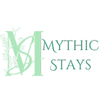

<h1></h1>


## 🧾Table of Contents
* [Introduction](#introduction)
* [Features](#features)
* [Getting Started](#getting-started)
* [Backend Details](#backend-details)

## Introduction
Welcome to Mythic Stays, a school project meant to mimic the functionalities of that shall not be named. The project focuses on delivering a seamless user experience with a robust design that is intuitive and responsive. This project highlights full-stack development, utilizing modern web technologies and frameworks, and allows users to browse and review mythical accomodations. The backend is built with Express.js and uses Sequelize as the ORM, while the frontend is developed using React and Redux. As the name implies, Mythic Stays is not a real website and is meant for learning purposes only.

### Live Site: *[Mythic Stays](https://mythic-stays.onrender.com/)*

<br>

## Features
* User authentication and authorization
* Browse functionalities
* Leave reviews and ratings
* View and manage lodgings

## Getting Started
Before you begin, ensure you have the following installed:

### Prerequisites
1.  Node.js (version 14.x or higher recommended)
2.  npm (usually comes with Node.js)
3.  Git

### Setup
1. To clone the project.
    ```bash
    git clone https://github.com/vinob09/mythic-stays.git
    cd mythic-stays
    ```

2. In the `backend` directory, create a `.env` file based on the `.env.example` file provided.

3. Install backend dependencies and setup SQLite development database.
    ```bash
    npm install
    npx dotenv sequelize db:migrate
    npx dotenv sequelize db:seed:all
    ```
4. Install frontend dependencies.
    ```bash
    cd ../frontend
    npm install
    ```

### Running the Application
1. In the `backend` directory, run `npm start` to start the backend server in development mode using nodemon.

2. In the `frontend` directory, run `npm run dev` to start the frontend Vite development server.

## Backend Details
Detailed information about the database schema and API endpoints can be found in the `backend` folder of this repository.
